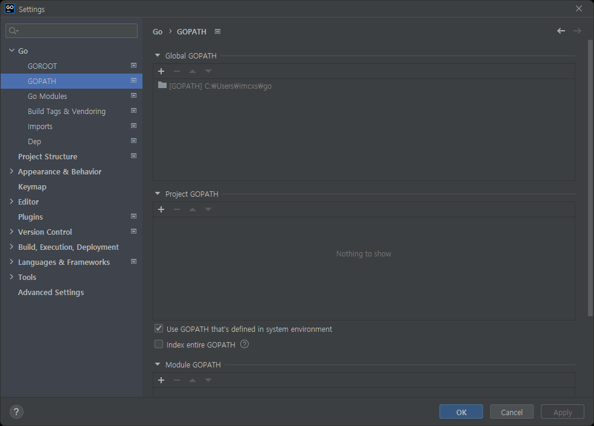

# Go

## Install Go

- [Download](https://golang.org/dl/)

```shell
> cd /tmp
> curl -LO https://go.dev/dl/${archive}
> sudo tar -zxf ${archive} -C /usr/local
```

```shell
> vi ~/.bashrc

export GOROOT=/usr/local/go
export GOPATH=$HOME/go
PATH=$PATH:$GOPATH/bin:$GOROOT/bin

> source ~/.bashrc
```

```shell
> go version
go version go1.18 linux/amd64
```

```shell
> go env
GOPATH="/home/markruler/go" # ${HOME}/go
GOROOT="/usr/local/go"
```

## on Windows

### SDK


### System environment variables


`GOROOT`, `GOPATH`


```shell
GOPATH = ${HOME}\go
GOROOT = C:\Program Files\Go
Path += %GOROOT%\bin

go env
# set GOENV=C:\Users\imcxs\AppData\Roaming\go\env
# set GOCACHE=C:\Users\imcxs\AppData\Local\go-build
# set GOMODCACHE=C:\Users\imcxs\go\pkg\mod
# set GOPATH=C:\Users\imcxs\go
# set GOROOT=C:\Program Files\Go
```

## GoLand




*`${HOME}/go`*

## 실행

```shell
> go run main.go
```
